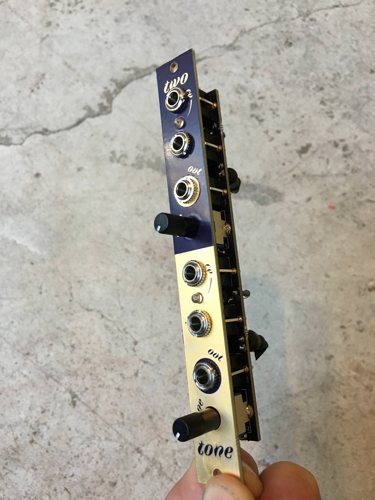
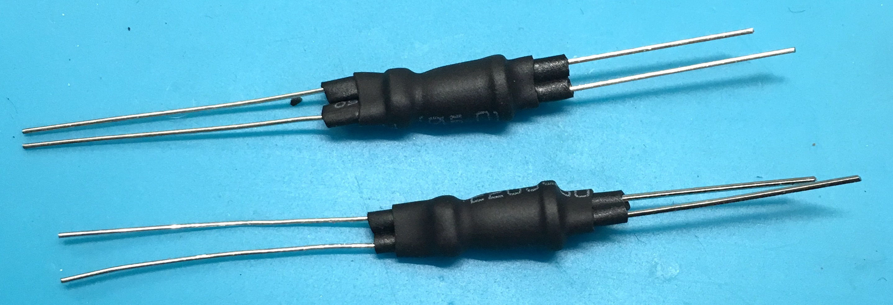

# two tone

I wanted to work on building a simple module from start to finish to test out some panel fab ideas and I thought a LPG/LPF would be a good candidate. After listening to Why We Bleep Ep.2 with Abstract Data and talking about the character of imperfection in analog circuits, I thought making a DIY vactrol based board would be interesting! I also thought if there were 2 halves, you could use slightly different components and vary each to make them truly distinct from one another. You can get different characteristics in the filter depending on the size and material of the LPF capacitor and the LDR/LED combo or vactrol used.

Shout out to [Look Mum No Computer](https://www.youtube.com/watch?v=Ch9w5JtbZSc) and [Meng Qi](https://www.mengqimusic.com/) for the initial inspiration for this module!

[Panel font by Alice Savoie / CNAP 19 CC BY-ND 4.0](http://cnap.graphismeenfrance.fr/faune/en.html)

more discussion of this project [on llllllll.co](https://llllllll.co/t/prototyping-two-tone-a-2x-passive-lowpass-gate-and-filter-with-diy-vactrols/12663)

### BOM:

| Quantity    | Component     |
| :------------- | :------------- |
| 2| Song Huei tall trimmer pots, B10k |
| 6 | thonkikonn mono jacks |
| 2 | 3mm LED's (White or Blue are best) |
| 2 | Capacitors, 0.1uf - 4.7uf works best. |
| 4 | 6.8k ohm resistors |
| 2 | DIY or NLS-32 vactrol |

### How to build a DIY vactrol:

http://guitarpcb.com/PDF%20Files/DIY%20Vactrol.pdf
 
https://www.youtube.com/watch?v=Je5FS1A7Ys0
 
https://www.youtube.com/watch?v=Ch9w5JtbZSc
 
https://www.youtube.com/watch?v=VZ1B0Epr770

The way I usually do it is to take some small heat shrink and heat shrink each leg of the LDR and LED and then hold the LDR and LED together with the light emitting and light sensing parts touching. Cover them in more heat shrink and heat! This way the large heat shrink holds them together while the small heat shrink on each leg prevents shorts.

for each DIY vactrol, I use:

| Quantity      |Component     |
| :------------- | :------------- |
|1|LDR – GL5549 – 45~140(kOhm) |
|1 | 5mm White LED|

---

[CC-BY-SA-4.0](https://creativecommons.org/licenses/by-sa/4.0/)
